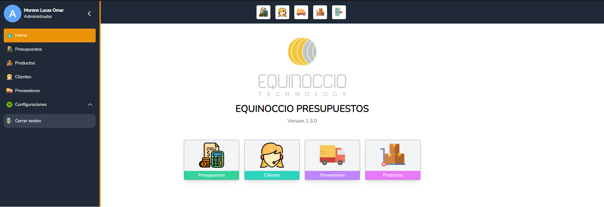

# Equinoccio template - Frontend 🎨 
Sistema de template - Equinoccio Technology - Frontend

[Ir al Backend - NestJS](https://github.com/equinocciotech/equinoccio-template-spa-server.git)


<p align="left">
  
</p>

## 📑 Tabla de Contenidos  
1. [Descripción](#descripcion)  
2. [Requerimientos previos](#requerimientos)  
3. [Instalación](#instalacion)  
4. [Desarrollo](#desarrollo)  
5. [Produccion](#produccion)  
6. [Capturas de pantalla](#capturas-pantalla)  
7. [Contacto](#contacto) 

## 📝 Descripción <a id="descripcion"></a>
- Template para generacion de SPA Frontend

## ✅ Requerimientos previos <a id="requerimientos"></a>
- Tener corriendo el backend de la aplicacion ([Ir al Backend - NestJS](https://github.com/equinocciotech/equinoccio-template-spa-server.git))
- Tener instalado - `Node v20.9.0` | `NPM v10.1.0` | `PNPM 8.15.1`
- Tener instalado - `Angular v17.3.8`

## 🛠️ Instalación <a id="instalacion"></a> 
```bash
# Clonar el repositorio
git clone https://github.com/equinocciotech/equinoccio-template-spa-client.git

# Instalacion de dependencias
pnpm i --save
```

## 🧑‍💻 Desarrollo <a id="desarrollo"></a> 

```bash
# Comenzar servidor de desarrollo
pnpm start
```

- El Frontend ya esta corriendo en la direccion `http://localhost:4200`

## 🚀 Produccion <a id="produccion"></a> 

- Asegurarse de configurar correctamente las variables de entorno en `/src/environments/environments.prod.ts`
- Generacion del archivo de produccion en la carpeta `/dist`

```bash
# Generacion de los archivos de produccion
ng build
```

- Los archivos de produccion se generan dentro de la carpeta `/dist/browser` y estan listos para ser copiados en la carpeta `/public` del backend

## 📸 Capturas de Pantalla <a id="capturas-pantalla"></a>
- Login


- Pantalla principal



## 📧 Contacto <a id="contacto"></a>  
Hecho por [Ing. Moreno Lucas Omar](https://github.com/inglucasmoreno). 
